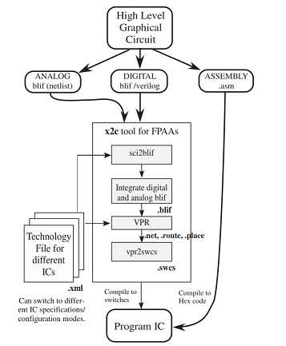

# ENES-205 Analog Design

## History

Circuits started off analog with resistors, inductors, capacitors, batteries, motors, then vacuum tubes, transistors, then digital, then tiny computers and software. The success of software has been turned around and is now programing digital FGPA rather than tiny computers.  At the leading edge of research, [software](http://hasler.ece.gatech.edu/SoCFPAA/Highlevel_tools_jlpea_February2016.pdf) is now [programming](https://www.news.gatech.edu/2016/03/02/configurable-analog-chip-computes-1000-times-less-power-digital) analog FPAAs. 

ENES-205 is about ANALOG blif (netlist) above. ENES-246 and 247 are about Digital blif/verilog above.  After transferring to 4 year institution, electrical/computer engineers will take a computer architecture/assembly class. Currently these are separate classes. Educational institutions change much slower than industry. Expect a future where these courses are leveraged into a career that transitions a huge part of civilization into a new, integrated set of tools . Read more about DARPA's [electronics resurgence initiative](https://www.darpa.mil/work-with-us/electronics-resurgence-initiative). 

## Goal 

The goal of this repository is to give calculation (in CHx folders) and simulation examples (in Labx folders) to support ENES-205 course at Howard Community College.  The complete workflow for the labs is:

​	**design** (draw a picture of the circuit)
​	**calculate** (create a jupyter file calculating all currents, voltages and component values if needed)
​	**simulate** (in KiCad, create electronic version for instructor to inspect and show instructor)
​	**build** (show instructor physical circuit)
​	**collect data** (discuss with instructor, create data for instructor to inspect)
​	**analyze** (Finish the README.md file with links to Lab Calculation, Simulation and Data)

## Tools

​	[Spice](https://en.wikipedia.org/wiki/SPICE) simulation is done with [NGspice](http://ngspice.sourceforge.net/docs/ngspice-manual.pdf) through [KiCad eeschema](http://ngspice.sourceforge.net/ngspice-eeschema.html). 
​	[Typora](https://typora.io/) (free markdown editor) is used to create documents like this
​	Labs and LabWriteUp are posted through GITHub repositories and  GIT Desktop
​	Waveforms software is used with the Agilent Analog Discovery 2
​	A thumb drive is necessary to get data collected by a Tektonix Oscilloscope into a computer

## Computers

​	All the software is installed and running on computers in the classrooms SET-165 and SET-253
​	All the software is installed and running on the laptop carts in SET-163 and SET-403
​	Laptops are available for a loan up to 24 hours from [HCC](http://howardcc.smartcatalogiq.com/en/2015-2016/Catalog/General-Information/Computer-Services/Laptop-Loans)
​	